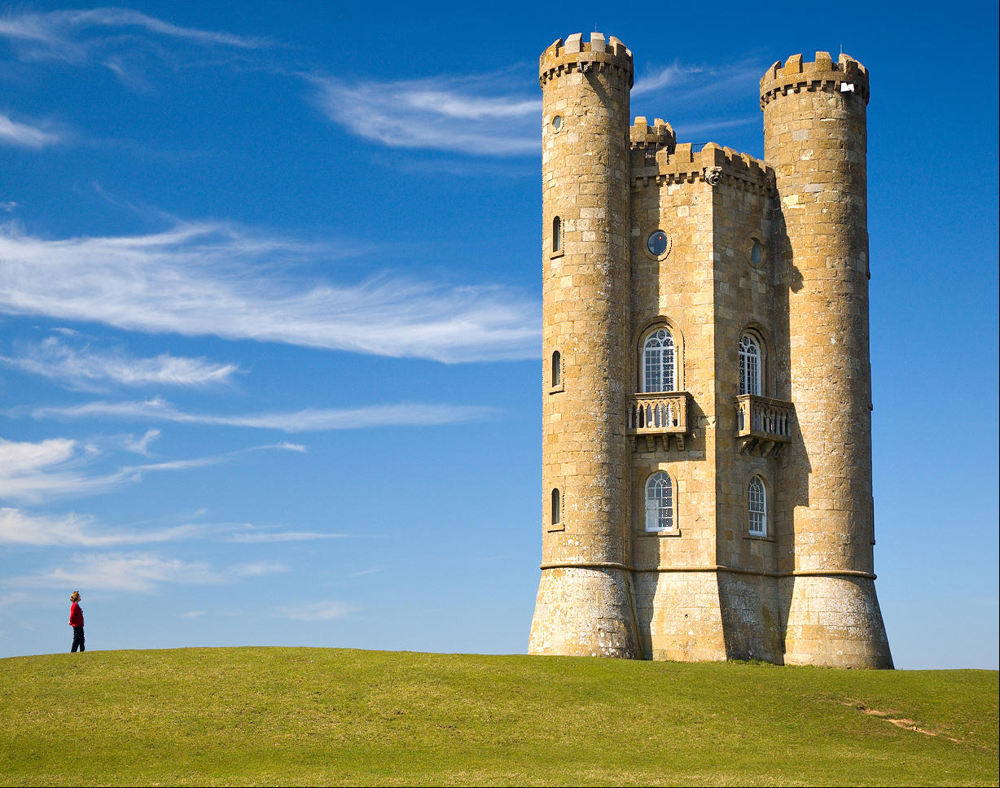

# seamd

Seamd is a seam carving implementation in Rust, just for fun. Seam carving is an algorithm for content aware image resizing.

## References
- Seam carving algorithm: [https://en.wikipedia.org/wiki/Seam_carving](https://en.wikipedia.org/wiki/Seam_carving)

## Examples

> **NOTE**: seamd does not handle paths well yet, so to run the following examples, copy the images from the `examples` folder to the root of the project.

```console
cargo run Broadway_tower.jpeg Broadway_tower_carved.jpeg 200 --highlight
```

<table>
  <tr>
    <td>Original</td>
    <td>Carved</td>
    <td>Original with carved seams highlighted</td>
  </tr>
  <tr>
    <td></td>
    <td></td>
    <td></td>
  </tr>
</table>